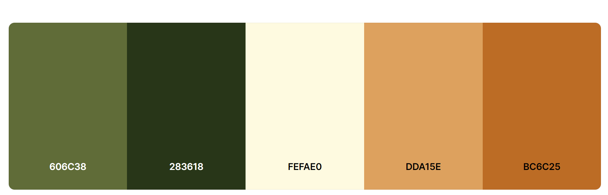

# Visit Hasslöv
## Features
### Existing Features
1. Navigation bar
Orange backgroundcolor has been chosen because Osbeck's beech forests are very beautiful in autumn and the autumn color describes the old forest with beech trees that are up to 200 years old. The handwritten style of the text has been chosen because of the Viking find in the "Lugnarohögen", and the old forest together with the Viking find. The salmon fishing that has been fished since time immemorial in the free river, i.e. no hydroelectric power plant in the river "stensån". The icons of the tree and the fish are inserted to show that the website is about both fishing and forest. The navigation bar contains home, gallery and contact. By clicking on each of them, users can go to different pages. It has been used :hover to highlight brown color.
## Typography

Borel font has been chosen because of the old-fashioned handwritten style that suits the subject of the website.
The Farsan font has been chosen because of its clarity and not too harsh style

## Design

### Color

