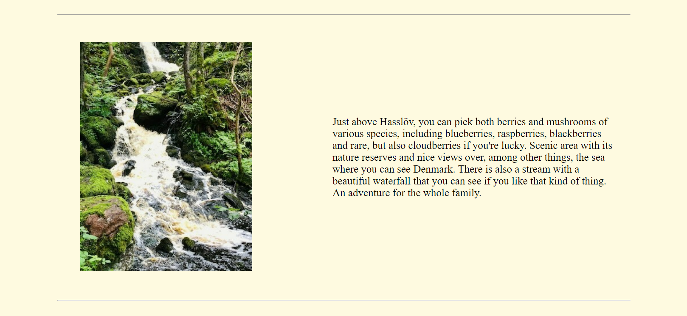
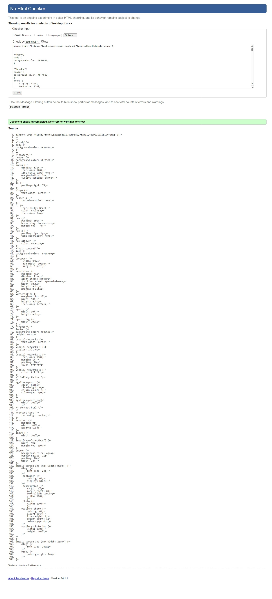

# Visit Hasslöv:

[My live project](https://blackcatten.github.io/Hassl-v/)

This is project 1 within CSS/HTML in code institute about Hasslöv. Hasslöv is a small village in southern Sweden with a long history. The village has both beautiful old forest and fine fishing waters.

## User Experience (UX):

### User Stories :
The website is for all users who want to experience the fine history of this historic little village of Hasslöv as a first time visitor.

- I want to show the user why Hasslöv is so unique in many different ways.
- I want to show southern Sweden from its best side.
- I want the user's experience of the page to be interesting for those interested in natural life.
- I want that if a user comes to the page, the user should be able to navigate to the homepage, gallery and contact.
- I want the user to be able to see via the website that there are various activities in Hasslöv. 

Second time visitors experience.

- I want it to feel like it was a beautiful country setting that's a bit irresistible so that users will be happy to come back to see the images.
- I want that when the user comes back, it should be easy to get in touch or ask different things via email on the contact page.
- I want users visiting the page for the second time to be able to quickly and easily search through the content for what they are looking for.

## Features:

### Existing Features:

1. Navigation bar.

- Orange backgroundcolor has been chosen because Osbeck's beech forests are very beautiful in autumn and the autumn color describes the old forest with beech trees that are up to 200 years old. The handwritten style of the text has been chosen because of the petroglyphs and the old forest together. The salmon fishing that has been fished since time immemorial in the free river, i.e. no hydroelectric power plant in the river "stensån". The icons of the tree and the fish are inserted to show that the website is about both fishing and forest. The navigation bar contains home, gallery and contact. By clicking on each of them, users can go to different pages. It has been used :hover to highlight brown color.

2. Home Page.

- The home page contains three images in three different places with text that is partly taken from wikipedia. The three different pictures represent the beech forest which is old and the waterfall which is small but beautiful and the last picture of the stone stream which is fishing related.

3. Gallery Page.

- The Gallery page contains pictures from Hasslöv and the surrounding area and viewpoints.

4. Contact Page.

- On the contact page, the user has the opportunity to write comments and wishes about what the user wants and goals for the trip, including whether the user wants a tourist guide.

5. Footer.

- The footer contains four icons that take the user to facebook, twitter, youtube and instagram.
- Thanks to these pages, the user can find information about Hasslöv with various social media wherever the user is in the world.
- The background color is dark green on the footer, while the icons are white, which is a balance between the colors.

## Typography:

- Borel font has been chosen because of the old-fashioned handwritten style that suits the subject of the website.

## Design:

### Color:

### Wireframe

## Testing:

1. Validator CSS-pass 

2. Validator HTML-pass
- Homepage-pass 

- Gallerypage-pass

- Contactpage-pass

Lighthouse: 

### User Story Testing

- I want to show the user why Hasslöv is so unique in many different ways.
    - Through pictures and information on this page, you can see the uniqueness of Hasslöv.
- I want to show southern Sweden from its best side.
    -As I describe, the incredible viewpoints are located just above Hasslöv and the user can find this in the text and in the picture.
- I want the user's experience of the page to be interesting for those interested in natural life.
    -The natural life is both on the front page and in the Gallery when you see fields and waterfalls.
- I want that if a user comes to the page, the user should be able to navigate to the homepage, gallery and contact.
    -It is possible by using links found in the navigation bar.
- I want the user to be able to see via the website that there are various activities in Hasslöv. 
    -By reading and looking at pictures, the user can see that there is both forest to discover that is old, viewpoints, fishing and waterfalls that not many people know about.

Second time visitors experience.

- I want it to feel like it was a beautiful country setting that's a bit irresistible so that users will be happy to come back to see the images.
    - Absolutely the user can come back and see these nice pictures and look at the waterfall which is beautiful.
- I want that when the user comes back, it should be easy to get in touch or ask different things via email on the contact page.
    - It is possible to come back and ask as many questions as the user wants.
- I want users visiting the page for the second time to be able to quickly and easily search through the content for what they are looking for.
    - The text is very clear, easy to look through and find details.
## Manual Testing:

## Deployment:

-The site was redirected to the GitHub pages. The steps to be passed are as follows:
- In the GitHub repository, navigate to the Settings tab.
- Select Pages on the tab in the sidebar on the left.
- Final syllable select head under branch.
- Press the Save button.
- The page has been renewed.
- You can find the live link on this page - https://blackcatten.github.io/Hassl-v/

## Technologies Used:

### Languages Used:

- [HTML](https://sv.wikipedia.org/wiki/HTML)
- [CSS](https://en.wikipedia.org/wiki/CSS)

### Frameworks, Libraries and Programs Used:

- [Font Awesome was used to create icons to footer.](https://fontawesome.com/)
- [Google Fonts was used to import 'Borel'and 'Farsan' that have been used for each page.](https://fonts.google.com/)
- [Git was used by utilising the Gitpod terminal to commit to Git and Push to GitHub.](https://git-scm.com/)
- [GitHub was used as a repository for code of the project.](https://github.com/)

## Credits: 

### Content:

- [wikipedia stensån](https://sv.wikipedia.org/wiki/Stens%C3%A5n)
- [wikipedia osbecks](https://sv.wikipedia.org/wiki/Osbecks_bokskogar)
- [wikipedia hasslöv](https://sv.wikipedia.org/wiki/Hassl%C3%B6v)

### Code: 

- Many of my codes are based on the [love running](https://github.com/Code-Institute-Solutions/love-running-v3) project.

### Media: 

- All photos have been taken by the developer.

## Acknowledgements:

- Special thanks to my mentor who showed me very useful codes and helped me simplify the website.